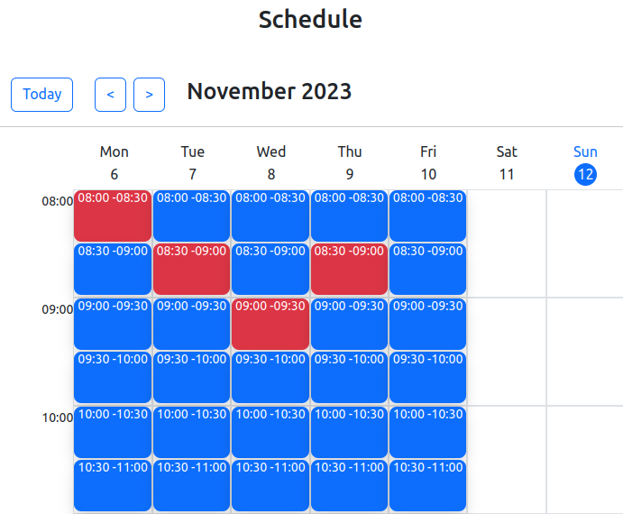
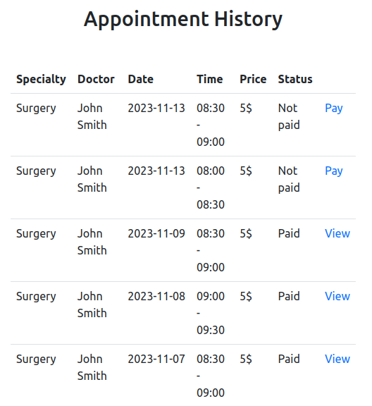

# Doctor appointment system

Doctors can manage their schedules.

Patients can book doctor appointments and pay for them using Stripe.

## Installation without docker

### Prerequisites: 
- Composer v2.5.8
- PHP v8.2.11
- Symfony CLI v5.5.8
- MySql v8.0.33
- Nodejs v20.5.1
- Npm v9.8.0
- Stripe Account
- Stripe CLI v1.17.2

### Steps:
1. `git clone https://github.com/IlyaMak/doctor-appointment`
2. `cp .env.example .env`
3. update DATABASE_URL, STRIPE_KEY, STRIPE_SECRET and STRIPE_ENDPOINT_SECRET variables in the .env
4. `sh build/build.sh`
5. `symfony server:start`
6. open http://localhost:8000
7. to use stripe run `stripe login` to log in on the stripe service (if you are not logged yet), then run in the separate command line - `stripe listen --forward-to localhost:8000/api/payment/stripe`

## Installation with docker compose

### Prerequisites:
Docker compose v2.21.0

### Steps:
1. `git clone https://github.com/IlyaMak/doctor-appointment`
2. `cp .env.example .env`
3. update STRIPE_KEY, STRIPE_SECRET and STRIPE_ENDPOINT_SECRET variables in the .env
3. `sh build/build-docker.sh`
4. open http://localhost:84
5. to use stripe run `stripe login` to log in on the stripe service (if you are not logged yet), then run in the separate command line - `docker compose exec php stripe listen --forward-to localhost:80/api/payment/stripe`

## Content of the php production service
php:
  image: user/doctor-appointment:v1.0.0
  ports:
    - '84:80'
  env_file:
    - .env

## Content of the php local service
php:
  build: 
    context: ./docker/php
  ports:
    - '84:80'
  volumes:
    - ./:/var/www/doctor-appointment

## Build and push production docker container
1. `docker build -t user/doctor-appointment:v1.0.0 -f Dockerfile .`
2. `docker push user/doctor-appointment:v1.0.0`

## How to send email if emails are sent asynchronously:
1. `php bin/console messenger:stats` - Show the message count for one or more transports
2. `php bin/console messenger:consume -vv` - Consume messages ('-vv' to see logs about consumed messages)

## How to use Stripe events:
1. Login to the Stripe account: `stripe login`
2. `stripe listen --forward-to localhost:8000/api/payment/stripe`

## How to use crontab:
1. To see the list of all cron jobs of the current user: `crontab -l`
2. To make a written cron job: `crontab crontab/crontab`
3. To test commands with a crontab on local machine use the full path of the "bin/console" command (/home/username/Projects/doctor-appointment/bin/console): `php /home/username/Projects/doctor-appointment/bin/console app:send-email-appoinment-reminder`

## To generate translations (example with english):
`symfony console translation:extract en --force --domain=messages`
